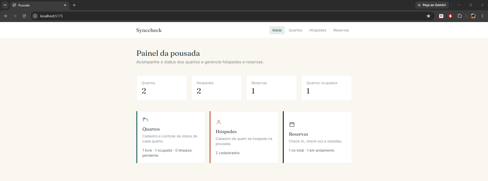
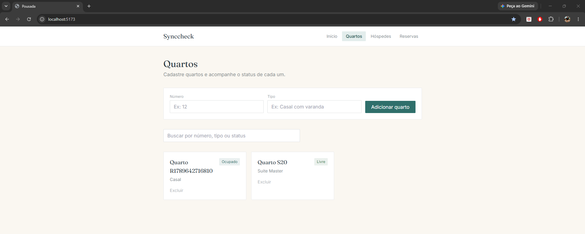
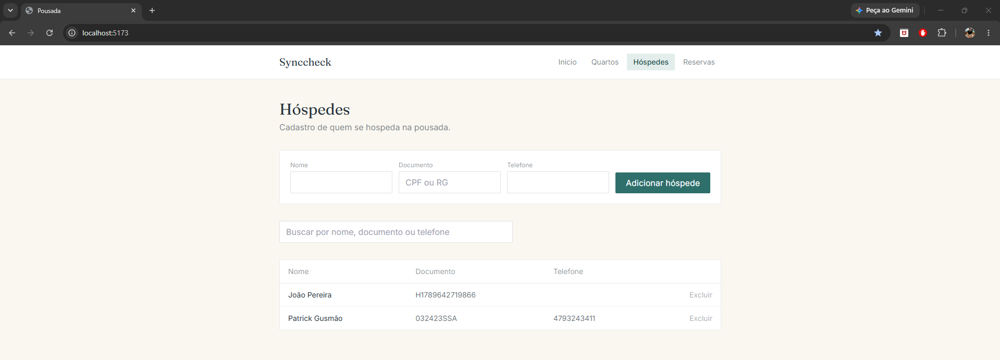
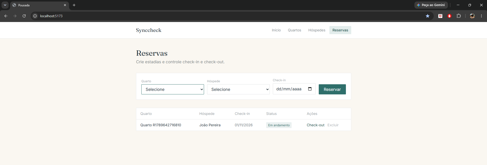

# 🏨 Sistema de Gestão de Hospedagem — Pequenos Hotéis/Pousadas

> **Grupo:** CHECKFLOW

Sistema desenvolvido para apoiar a gestão de pequenas pousadas e hotéis, centralizando o controle de **quartos, hóspedes, reservas, check-in e check-out**.

A aplicação também auxilia a comunicação entre a **recepção e a governança (limpeza)**, controlando o ciclo de vida dos quartos e evitando inconsistências operacionais.

## Contexto

Uma pousada de praia familiar quer automatizar seu processo de check-in e check-out. Hoje, quartos liberados pelo cliente ficam sem limpeza por falta de comunicação com a governança. O sistema resolve isso controlando o ciclo de vida do quarto (Livre → Ocupado → Limpeza Pendente → Livre) e impondo regras de negócio que impedem inconsistências operacionais.

## 🔄 Revisão do Product Owner e Melhorias

Após a entrega inicial, o **Product Owner (PO)** realizou uma revisão das funcionalidades desenvolvidas pela equipe e solicitou alguns ajustes pontuais para melhorar a experiência de uso e a visualização das informações, mantendo a lógica principal do sistema.

Entre as melhorias realizadas estão:

- 📊 **Painel inicial aprimorado:** inclusão de indicadores com as quantidades sumarizadas de quartos, hóspedes e reservas, facilitando a visualização rápida da situação da pousada;
- 🔎 **Busca e ordenação:** melhorias na consulta e organização das informações de quartos e hóspedes;
- 📅 **Datas no padrão brasileiro:** as datas de check-in e check-out passaram a ser exibidas no formato utilizado no Brasil (`dd/mm/aaaa`);
- 🏨 **Identificação dos quartos:** melhoria na seleção dos quartos, apresentando número, tipo e status;
- ✅ **Feedback das operações:** inclusão de mensagens de sucesso e indicadores de carregamento durante as operações;
- 🔒 **Prevenção de ações duplicadas:** bloqueio temporário dos botões enquanto uma requisição está sendo processada;
- 📱 **Melhoria de responsividade:** ajustes nas tabelas para facilitar a visualização em telas menores;
- 🚪 **Validação de check-out:** inclusão de validação do status da reserva antes da realização do check-out.

Esses ajustes complementam a versão inicial do sistema, buscando tornar a aplicação mais clara e prática para a operação diária, sem alterar as principais regras de negócio já implementadas.

## 📸 Demonstração do Sistema

Abaixo estão algumas das principais telas do sistema após as melhorias realizadas.

### 📊 Painel Inicial

Visão geral da operação, apresentando indicadores sumarizados de quartos, hóspedes e reservas.



### 🛏️ Gestão de Quartos

Tela utilizada para consultar e gerenciar os quartos da pousada, incluindo suas principais informações e status.



### 👥 Gestão de Hóspedes

Área destinada à consulta e gerenciamento dos hóspedes cadastrados no sistema.



### 📅 Gestão de Reservas

Tela de gerenciamento das reservas, permitindo acompanhar informações relacionadas às estadias, check-in e check-out.



## Escopo por entrega

| Nível | Escopo |
|-------|--------|
| **N1** | Cadastro de quartos e hóspedes; reserva de estadias; controle do estado do quarto (Livre, Ocupado, Limpeza Pendente); RN crítica de bloqueio de check-in. |
| **N2/N3** | Lançamento do consumo do minibar diretamente no extrato do quarto; precificação dinâmica (alta/baixa temporada). |

## Documentação

- [`REQUISITOS.md`](REQUISITOS.md) — Requisitos funcionais, não funcionais e regras de negócio.
- [`GLOSSARIO.md`](GLOSSARIO.md) — Definição dos termos do domínio.
- [`MODELO-DOMINIO.md`](MODELO-DOMINIO.md) — Entidades, atributos e a máquina de estados do quarto.

## Equipe

| Integrante | Papel |
|---|---|
| Patrick Gusmão | Product Owner (PO) |
| Iago Koch | Engenheiro de Requisitos |
| Caio Rosa | Quality Assurance (QA) |
| William Vodzinsky | Desenvolvedor Frontend |
| João Silva | Desenvolvedor Backend |
| Pedro Israel | DevOps |

## Informações acadêmicas

- **Disciplina:** Manutenção e Melhoria de Software
- **Professor:** Rogério Elias da Cunha

## 📁 Estrutura do Projeto

O projeto está organizado separando a aplicação em **backend**, **frontend**, documentação e recursos de apoio aos testes.

```text
checkflow/
├── backend/                 # API e regras de negócio
├── frontend/                # Interface web da aplicação
├── docs/
│   └── images/              # Imagens utilizadas no README
│       ├── hospedes.png
│       ├── painel-inicio.png
│       ├── quartos.png
│       └── reservas.png
├── postman/                 # Recursos e configurações para testes da API
├── .postman/                # Configurações auxiliares do Postman
├── .gitignore               # Arquivos e diretórios ignorados pelo Git
├── GLOSSARIO.md             # Glossário dos termos do domínio
├── MODELO-DOMINIO.md        # Modelo de domínio do sistema
├── Matriz de Papéis.md      # Definição dos papéis da equipe
├── README.md                # Documentação principal do projeto
└── REQUISITOS.md            # Requisitos e regras de negócio

## Como executar o projeto

### Pré-requisitos

Antes de iniciar, é necessário ter instalado:

- Node.js
- npm
- Git

### Backend

Abra o terminal na pasta do projeto e execute:

```bash
cd backend
npm install
npm run dev
```

Deixe esse terminal aberto enquanto estiver utilizando o sistema.

### Frontend

Abra outro terminal na pasta do projeto e execute:

```bash
cd frontend
npm install
npm run dev
```

Após iniciar, o terminal mostrará o endereço para acessar o sistema no navegador.

### Banco de dados

O projeto utiliza SQLite e o banco de dados está localizado em:

```text
backend/pousada.db
```

### Observação

A pasta `node_modules` não fica armazenada no GitHub. Por isso, ao clonar o projeto em outro computador, é necessário executar `npm install` tanto no backend quanto no frontend.
